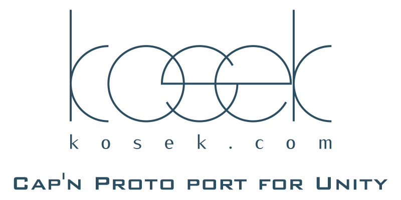

# Cap'n Proto port for Unity

A Cap'n Proto implementation for .NET Standard 2.0 (credits to [lostinplace](https://github.com/lostinplace)) and .NET Core (credits to [c80k](https://github.com/c80k)) ported to Unity (credits to [kosek.com](https://github.com/kosek-com)).

["Cap'n Proto is an insanely fast data interchange format and capability-based RPC system."](https://capnproto.org/) Whilst the original implementation is written in C++ there are several ports to other languages. This is a C# implementation for .NET Core ported especially for Unity.

Disclaimer: Neither this project nor its author are affiliated with Cap'n Proto. This is just yet another independent implementation of the specification. The following sections assume that you are familiar with [Cap'n Proto](https://capnproto.org/) and probably its [GitHub project](https://github.com/capnproto/capnproto).

## Experimental packages

The only experimental package used by Unity setup is test-runner version 2.0. It is the first Unity test-runner that supports async code.

If you do not need tests yourself, there is no need to include any experimental packages

## Progress

The following Cap'n Proto features are currently ported to Unity:

 - [x] Runtime support
 - [ ] Runtime tests (partially done)
 - [ ] Cap'n Proto generator directly in Unity
 - [ ] Cap'n Proto generator tests

## Features

The following Cap'n Proto features are currently implemented:
- Serialization/deserialization of all kinds of data (structs, groups, unions, lists, capabilities, data, text, enums, even primitives)
- Generics
- Level 1 RPC, including promise pipelining, embargos, and automatic tail calls
- Security (pointer validation, protection against amplification and stack overflow DoS attacks)
- Compiler backend generates reader/writer classes, interfaces, proxies, skeletons (as you know it from the C++ implementation), and additionally so-called "domain classes" for all struct types. A domain class is like a "plain old C# class" for representing a schema-defined struct, but it is decoupled from any underlying message. It provides serialize/deserialize methods for assembling/disassembling the actual message. This provides more convenience, but comes at the price of non-zero serialization overhead (not "infinitely" faster anymore).

These features are not yet implemented:
- Level N RPC with N ≥ 2
- Packing
- Compression
- Canonicalization
- Dynamic Reflection
- mmap
